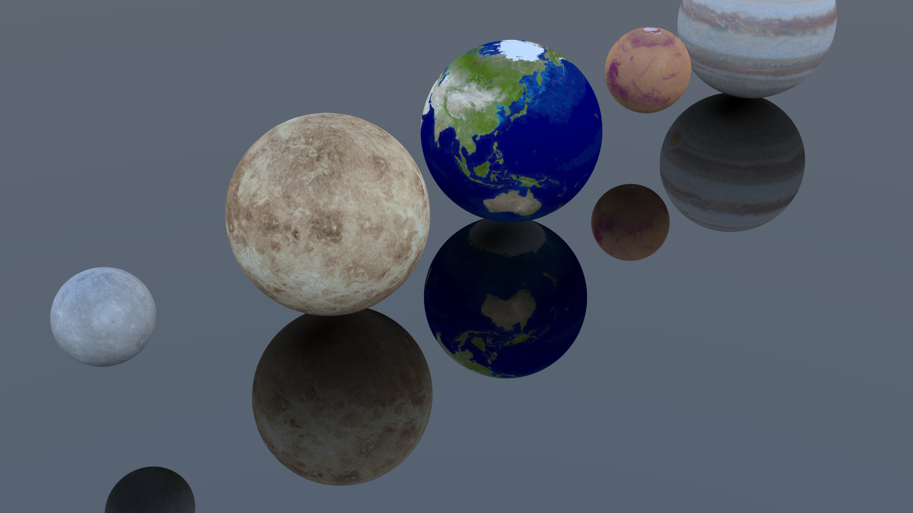

# Raytracer accelerato via CUDA

Questo repository contiene il codice per un semplice raytracer accelerato
via CUDA, sviluppato per il corso di GPU Computing.

Una relazione di introduzione al raytracing ed al problema di parallelizzarlo
tramite CUDA è disponibile nel file [relazione.pdf](relazione.pdf)

## Come compilare ed eseguire
Per compilare ed eseguire il raytracer, assumendo che il toolkit CUDA sia
installato, basta eseguire:

    make all
    ./rt

Di default il progetto è compilato con la Compute Capability 7.5, per modificarla
basta andare nel Makefile e cambiare la variabile `NVCCFLAGS`.

Per chi non possiede una GPU NVIDIA è possibile usare Google Colab crendo una cella nel notebook ed eseguendo il seguente codice:

    %cd /content
    !rm -rf cuda-raytracer
    !git clone https://github.com/mrkct/cuda-raytracer.git
    %cd cuda-raytracer
    !make clean all

    !./rt

    from IPython.display import Image
    Image(filename='_000000000.png')

## Opzioni di configurazione
Il raytracer include alcune semplici opzioni di configurazione elencate qui sotto:

* `--width`: Imposta la larghezza dell'immagine prodotta
* `--height`: Imposta l'altezza dell'immagine prodotta
* `--samples`: Imposta il numero di raggi da proiettare per pixel
* `--output`: Imposta il prefisso nel path per le immagini prodotte

L'immagine sopra è stata prodotta con le seguenti opzioni:

    !./rt --width 1920 --height 1080 --samples 128